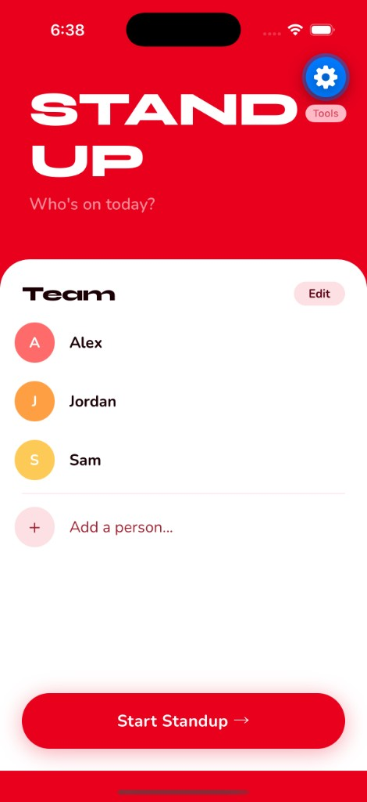
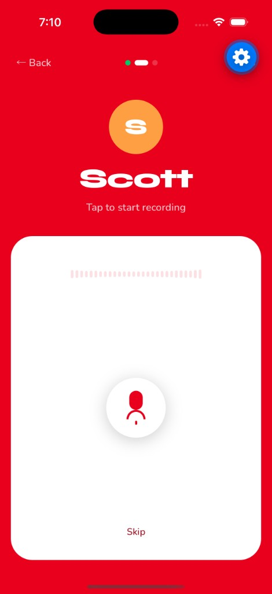
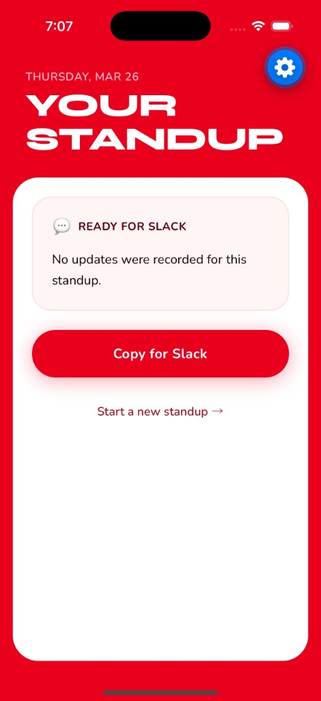

# Standup

A universal Expo app for running daily standups. Records each team member's voice update, transcribes it with Gemini AI, and generates a summary ready to paste into Slack.


<p align="center">
  
  
  
</p>

## Features

- **Team roster** — saved locally, persists between sessions
- **One-by-one recording** — each person taps to record their update
- **Live waveform** — audio bars respond to your voice in real time
- **AI transcription** — Gemini transcribes each recording on-device (no server)
- **AI summary** — freeform Slack-ready summary generated from all transcripts
- **Copy to Slack** — one tap copies the formatted summary to clipboard
- **Universal** — runs on iOS, Android, and Web

## Tech Stack

- [Expo](https://expo.dev) SDK 55 with Expo Router
- [expo-audio](https://docs.expo.dev/versions/latest/sdk/audio/) for recording + metering
- [Gemini API](https://ai.google.dev) (`gemini-3.1-flash-lite-preview`) for transcription and summary
- [React Native Reanimated](https://docs.swmansion.com/react-native-reanimated/) for animations
- Syne + Nunito via `@expo-google-fonts`

## Getting Started

### 1. Clone and install

```bash
git clone https://github.com/ryanvoevodin/cursor-demo.git
cd cursor-demo
npm install
```

### 2. Add your Gemini API key

Create a `.env` file in the root:

```
EXPO_PUBLIC_GEMINI_API_KEY=your_key_here
```

Get a free key at [aistudio.google.com](https://aistudio.google.com).

### 3. Run

```bash
# Web
npx expo start --web

# iOS
npx expo start --ios

# Android
npx expo start --android
```

## Deploy

### Web (Vercel)

```bash
vercel --prod
```

### Expo Go (EAS Update)

```bash
eas update --branch main --message "Release"
```

## Project Structure

```
app/
  _layout.tsx     # Root layout, fonts, theme
  index.tsx       # Home screen — team roster
  standup.tsx     # Recording flow
  summary.tsx     # AI summary + copy to Slack
components/
  AudioWaveform.tsx   # Live mic visualizer
  RecordButton.tsx    # Animated record button
  PersonCard.tsx      # Team member row
  SummaryView.tsx     # Summary card + copy CTA
services/
  gemini.ts       # transcribeAudio() + generateSummary()
store/
  teamStore.ts    # Team roster with AsyncStorage persistence
hooks/
  useAudioRecorder.ts  # Cross-platform audio recording hook
constants/
  theme.ts        # Colors, fonts, spacing
```
